# Prep: Introduction to SQL

Things I learned about SQL

- SQL is a structured language used to get information from a relational DB and also to update, add, and delete data from that Database. Once I understood the keywords that SQL used, it was easy to convert the tasks in to sql commands that returned the data we were being asked. Im excited to Learn more about using Relational Databases and creating multiple tables using CRUD in 401.

Exercise 1: 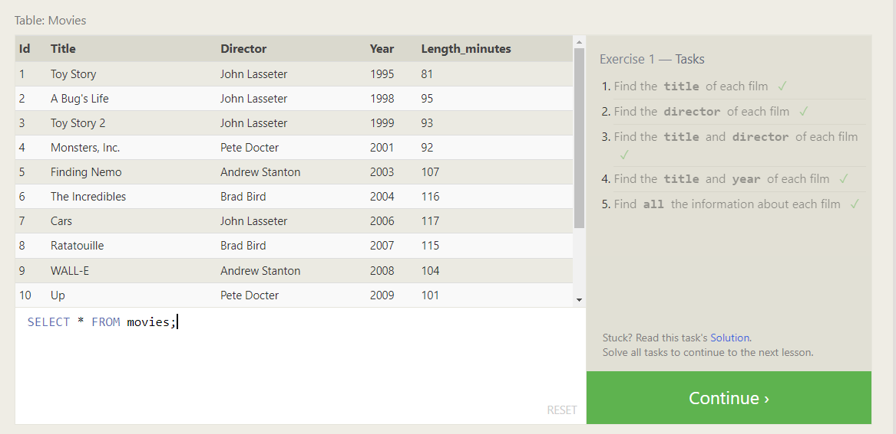
Exercise 2: 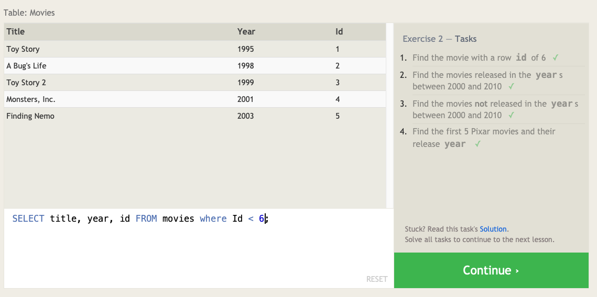
Exercise 3: 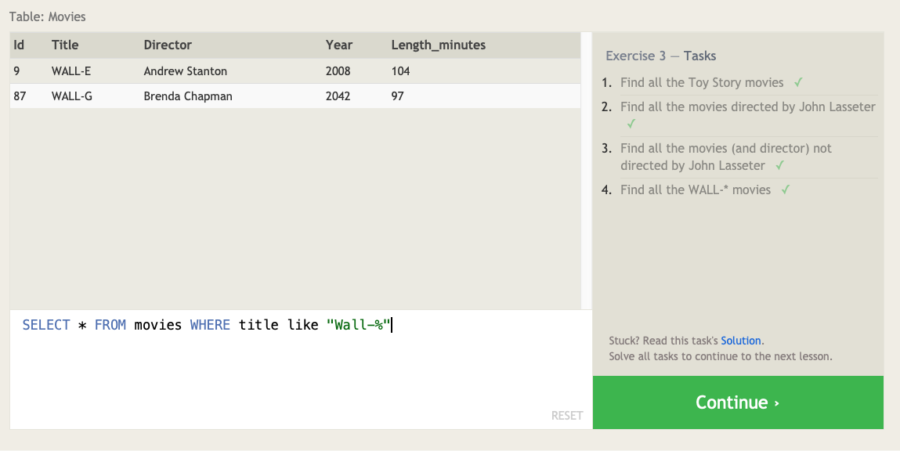
Exercise 4: 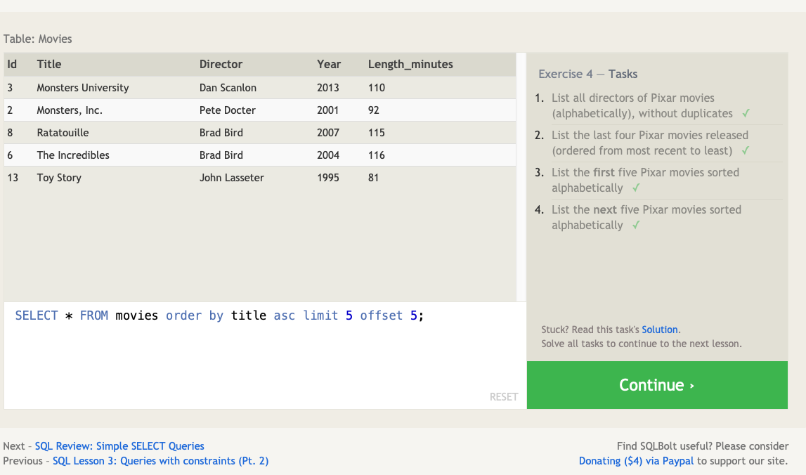
Exercise 5: 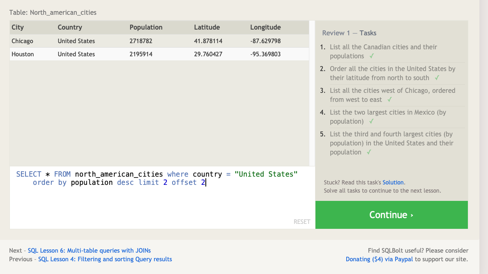
Exercise 6: 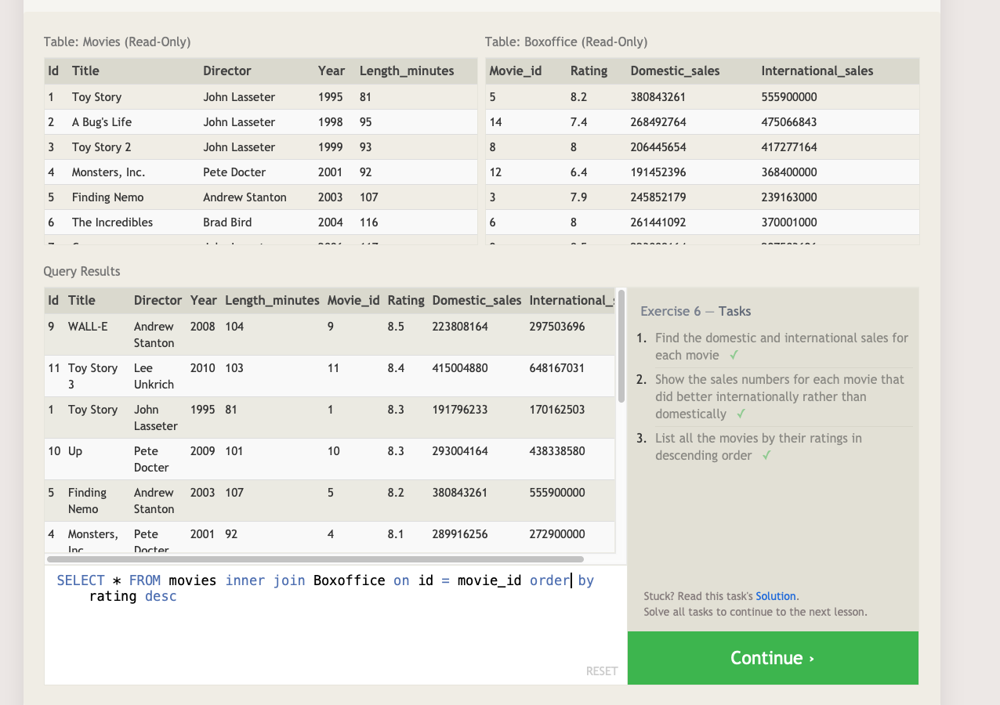
Exercise 13: 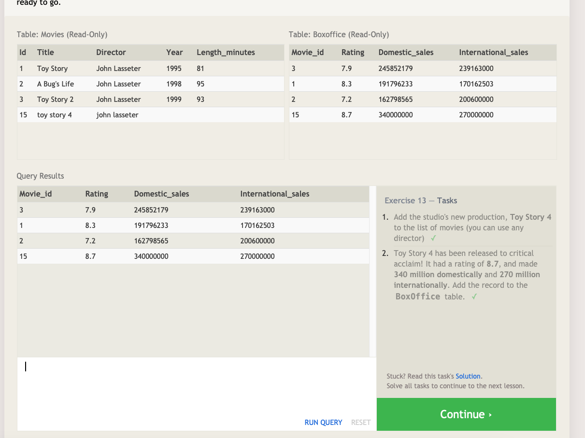
Exercise 14: 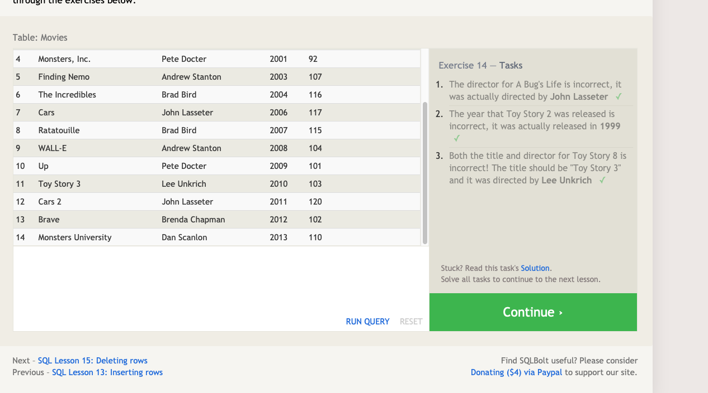
Exercise 15: 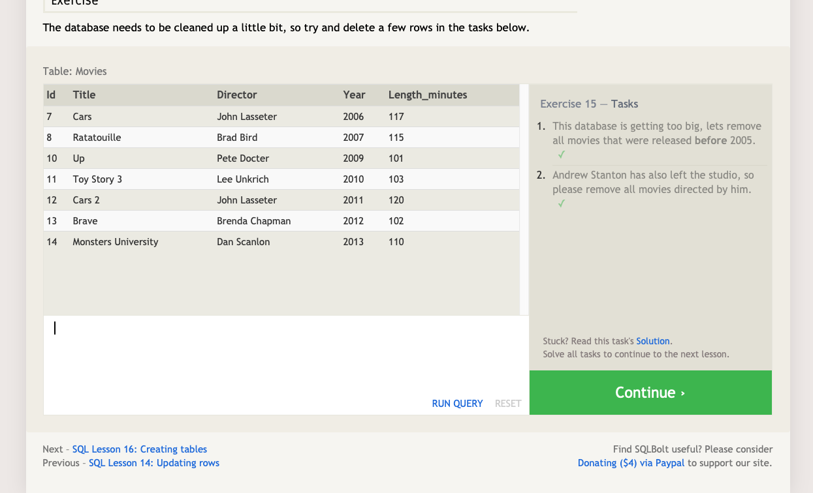
Exercise 16: 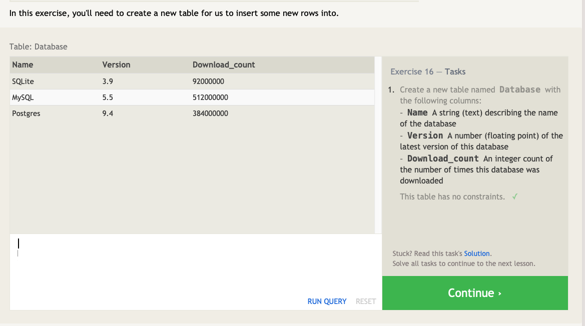
Exercise 17: 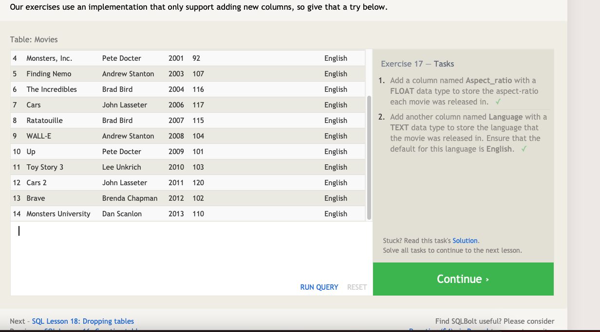
Exercise 18: 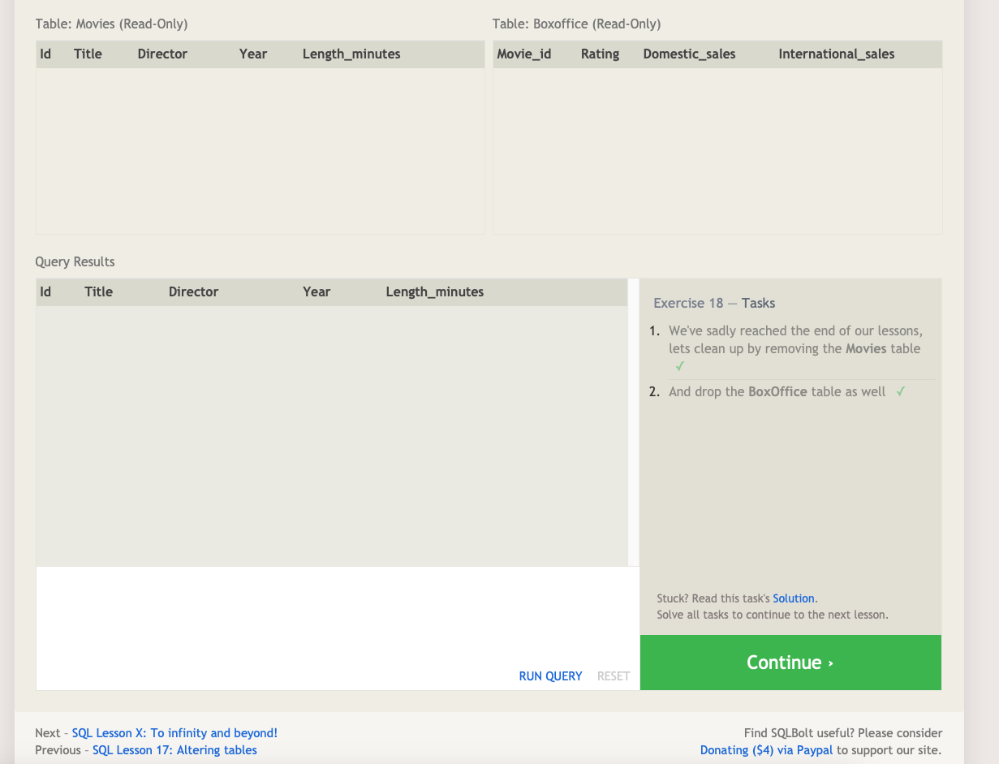

